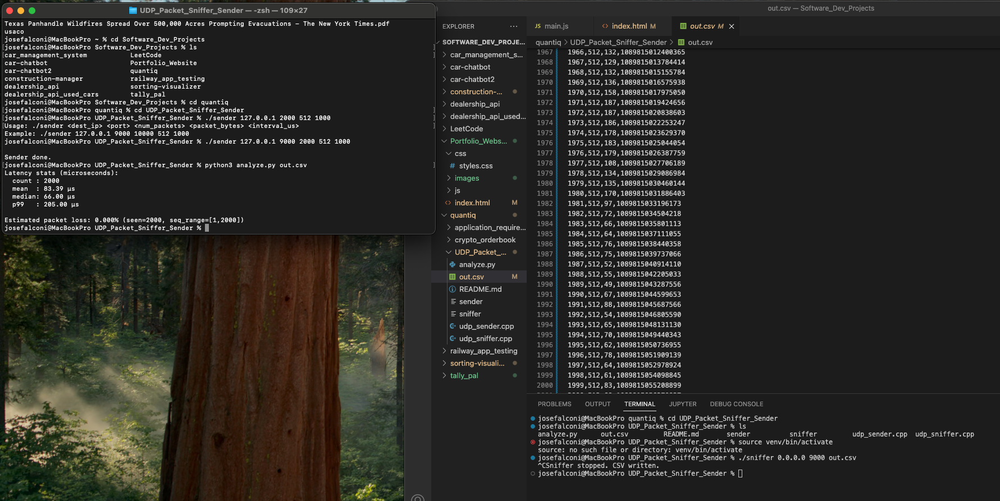

# UDP Packet Sniffer & Latency Logger



## 📌 Overview

This project demonstrates a simple **UDP-based packet capture and latency logging system** written in C++.

It includes:

- A **sniffer** program that binds to a UDP port, receives packets, extracts metadata, and logs results to CSV.
- A **sender** program that generates UDP packets with embedded sequence numbers and timestamps, allowing the sniffer to calculate per-packet latency.

This project highlights:

- Proficiency in **C++ networking** (sockets, UDP, TCP/IP stack basics).
- Writing **low-latency, non-blocking network code** with `poll()` for responsiveness.
- Handling **timestamps and performance measurements** for packet latency.
- Producing structured logs for later analysis in tools like Python or Excel.

---

## ⚙️ How It Works

### Sender

- Constructs packets containing:
  - `seq`: a sequence number.
  - `send_ns`: timestamp in nanoseconds (from `steady_clock`).
- Sends packets at a configurable size and rate to the target IP/port.

### Sniffer

- Binds to a UDP port and listens for incoming packets.
- On receipt, extracts the header (`seq` + `send_ns`).
- Timestamps arrival (`recv_ns`) and computes latency (µs):
- Logs results to a CSV file with columns:
- seq,recv_bytes,latency_us,recv_ns

## 🚀 Build

Compile both programs with `g++`:

```bash
g++ -O3 -std=c++17 udp_sniffer.cpp -o sniffer
g++ -O3 -std=c++17 udp_sender.cpp -o sender
```

## Usage

### Run the sniffer

./sniffer 0.0.0.0 9000 out.csv

0.0.0.0: bind to all interfaces

9000: UDP port

out.csv: file where packet logs are written

Stop with Ctrl+C (sniffer is non-blocking and exits cleanly).

### Run the sender

./sender 127.0.0.1 9000 2000 512 1000

### Arguments:

- Destination IP (e.g., 127.0.0.1)

- Destination port (e.g., 9000)

- Number of packets (e.g., 2000)

- Packet size in bytes (e.g., 512)

- Interval between packets in microseconds (e.g., 1000 µs = 1ms)

## 📊 Example Output

### Example snippet of out.csv:

seq,recv_bytes,latency_us,recv_ns
1,512,123,123456789012345
2,512,110,123456789113456
3,512,118,123456789223567

This can be analyzed to compute mean, median, p99 latency, and packet loss (if sequence gaps are detected).

## 🔑 Key Takeaways

Demonstrates UDP networking fundamentals (sockets, bind, sendto, recvfrom).

Shows ability to handle signal interrupts, non-blocking I/O, and clean shutdowns.

Provides a basis for measuring latency, jitter, and packet drops — all critical concepts in high-frequency trading (HFT) and low-latency systems.
